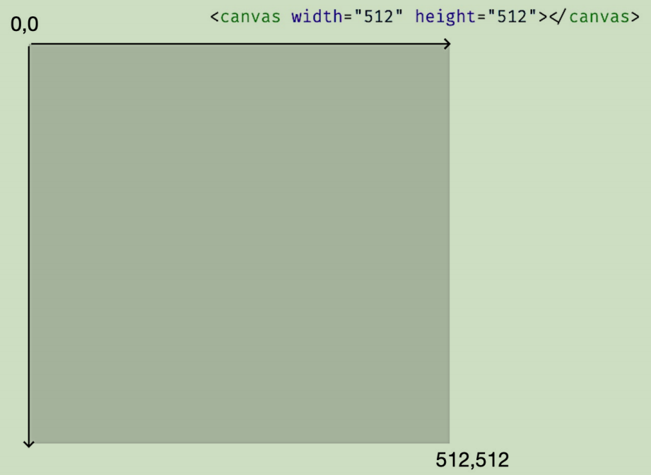

# Canvas基础知识

::: normal-demo 引入d3.js

```js
const head = window.document.head
const script = window.document.createElement('script');
script.type = "text/javascript";
script.setAttribute("src","/lib/d3.v7.min.js");
head.appendChild(script);
```

:::

## 画布宽高和样式宽高

- Canvas元素有两个宽高，一个是元素属性上的宽高(不带px)，一个是CSS中的宽高(带px)。元素属性上的宽高决定Canvas画布的坐标范围，CSS中的宽高决定Canvas在页面上呈现的大小。我们将前者称为**画布宽高**，后者称为**样式宽高**。
- 设计两种宽高的作用：适配不同分辨率的设备时，样式宽高可能会根据设备分辨率不同而自适应变化，而此时画布宽高一定不能跟着样式宽高发生变化，否则Canvas中的代码效果会彻底乱套，所以**一定要设置画布宽高**。

> 创建Canvas代码如下：

```html
<canvas width="512" height="512"> Canvas not supported </canvas>
```

## Canvas的坐标系

Canvas的坐标系和浏览器窗口的坐标系类似，它们都默认左上角为坐标原点，x轴水平向右，y轴垂直向下。
> 一个512*512的canvas坐标系如下：



## 2D绘图上下文

Canvas2D的API大致分为两类

1. 设置状态的API，用来设置或改变当前的绘图状态，如图形颜色、线宽、坐标等
2. 绘制指令API，用来绘制不同形状的几何图形

> 创建API对象(绘图上下文)：

``` ts
// 获取Canvas元素
const canvas = document.querySelector('canvas')!;
// 获取2D绘图上下文
const context = canvas.getContext('2d')!;
```

## 画布平移

有时候为了方便计算绘制顶点的坐标，需要将画布平移，平移后坐标系的原点会跟着平移，但浏览器可视区位置不变


> 例如，下面是将画布向右和向下各自平移10像素：

```ts
const x = 10;
const y = 10;
const canvas = document.querySelector('canvas')!;
const context = canvas.getContext('2d')!;
context.translate(x, y);
```

## 绘制矩形实例

::: normal-demo 绘制一个100*100的绿色正方形

```html
<canvas width="200" height="200"> 
 Canvas not supported
</canvas>
```

```js
 // 要绘制的矩形
 const rect = {
  width: 100,
  height: 100,
 };
 const canvas = document.querySelector('canvas');
 const context = canvas.getContext('2d');
 // 暂存画布状态，填充颜色、画布偏移情况等
 context.save();
 // 向左上角平移画布，这样方便计算绘制顶点的坐标
 context.translate(-0.5 * rect.width, -0.5 * rect.height);
 // 设置填充色
 context.fillStyle = '#3eaf7c';
 // 开始绘制路径
 context.beginPath();
 // 绘制一个矩形，起点为左上角，参数为：起点x坐标，起点y坐标，宽，高
 context.rect(0.5 * canvas.width, 0.5 * canvas.height, 100, 100);
 // 将绘制的内容填充到画布上
 context.fill();
 // 恢复画布状态为暂存时的状态
 context.restore();
```

```css
canvas {
  background-color: #282c34;
}
```

:::

## D3.js绘制关系图实例

::: normal-demo 绘制一个100*100的绿色正方形

```html
 <canvas width="200" height="200"> 
  Canvas not supported
</canvas>
```

```js
setTimeout(() => {
  console.log(d3);
}, 100); 
```

```css
canvas {
  background-color: #282c34;
}
```

:::
